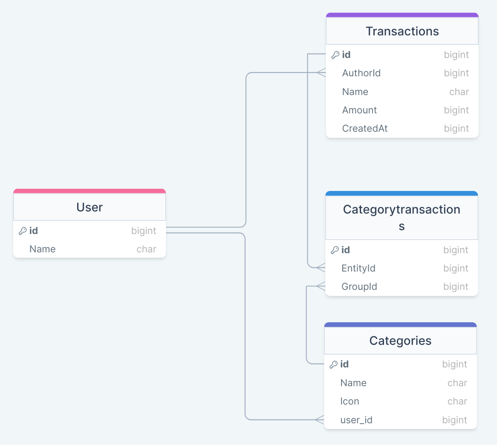

<a name="readme-top"></a>

<div align="center">
  
  <br/>

  <h1><b>Welcome to my project 😃</b></h1>

</div>

<div align="center">
  
  <br/>
<h1 align="center">Budget Manager</h1>





</div>

<!-- TABLE OF CONTENTS -->

# 📗 Table of Contents

- [📗 Table of Contents](#-table-of-contents)
- [📖 Budget app ](#-budget-app-)
  - [🛠 Built With ](#-built-with-)
    - [Tech Stack ](#tech-stack-)
    - [Key Features ](#key-features-)
  - [🚀 Live Demo ](#-live-demo-)
  - [💻 Getting Started ](#-getting-started-)
    - [Prerequisites](#prerequisites)
    - [Setup](#setup)
    - [Install](#install)
    - [Usage](#usage)
    - [Run tests](#run-tests)
    - [Deployment](#deployment)
  - [👥 Authors ](#-authors-)
  - [🔭 Future Features ](#-future-features-)
  - [🤝 Contributing ](#-contributing-)
  - [⭐️ Show your support ](#️-show-your-support-)
  - [🙏 Acknowledgments ](#-acknowledgments-)
  - [📝 License ](#-license-)

<!-- PROJECT DESCRIPTION -->

# 📖 Budget Manager <a name="about-project"></a>

**Budget Manager** is a mobile web application where you can manage your budget where you have a list of transactions associated with a category, so that you can see how much money you spent and on what.

## 🛠 Built With <a name="built-with"></a>

### Tech Stack <a name="tech-stack"></a>

<details>
  <summary>Server</summary>
  <ul>
    <li><a href="https://rubyonrails.org/">Ruby on Rails</a></li>
  </ul>
</details>

<details>
<summary>Database</summary>
  <ul>
    <li><a href="https://www.postgresql.org/">PostgreSQL</a></li>
  </ul>
</details>

<!-- Features -->

### Key Features <a name="key-features"></a>

- **register and log in.**
- **Display and create transactions associated with a category.**
- **see the money spent on each category.**

<p align="right">(<a href="#readme-top">back to top</a>)</p>

<!-- LIVE DEMO -->

## 🚀 Live Demo <a name="live-demo"></a>

- https://mana-jdee.onrender.com

## Live video demo 

- https://www.loom.com/share/9205125a16b6432485ee3d3e906b9986?sid=f3d54dff-1b49-413a-95ed-331c52e25cb1

<p align="right">(<a href="#readme-top">back to top</a>)</p>

<!-- GETTING STARTED -->

## 💻 Getting Started <a name="getting-started"></a>

To get a local copy up and running, follow these steps.

### Prerequisites

In order to run this project you need:

- `Text Editor (VSCode, Sublime)`
- `Ruby`

### Setup

Clone this repository to your desired folder:

```sh
  cd my-folder
  git clone https://github.com/otmaneechchafyky/Budget-app.git
```

### Install

Install this project with:

```sh
  cd my-project
  bundle install
```

### Usage

To run the project, execute the following command:

```sh
  rails server
```

### Run tests

To run tests, run the following command:

```sh
  rspec spec
```

### Deployment

- n/a

<p align="right">(<a href="#readme-top">back to top</a>)</p>

<!-- AUTHORS -->

## 👥 Authors <a name="authors"></a>

👤 **Salim Bamahfoodh**

- GitHub: [@otmanechchafyky](https://github.com/otmaneechchafyky)
- LinkedIn: [Otmane Echchafyky](https://www.linkedin.com/in/otmane-echchafyky/)

<p align="right">(<a href="#readme-top">back to top</a>)</p>

<!-- FUTURE FEATURES -->
## 🔭 Future Features <a name="future-features"></a>

- [ ] **Add option to modify your data**
- [ ] **Add option to move a transaction from a category to another one**

<p align="right">(<a href="#readme-top">back to top</a>)</p>

<!-- CONTRIBUTING -->

## 🤝 Contributing <a name="contributing"></a>

Contributions, issues, and feature requests are welcome!

Feel free to check the [issues page](https://github.com/otmaneechchafyky/Budget-app/issues/).

<p align="right">(<a href="#readme-top">back to top</a>)</p>

<!-- SUPPORT -->

## ⭐️ Show your support <a name="support"></a>

If you like this project consider adding a ⭐️

<p align="right">(<a href="#readme-top">back to top</a>)</p>

<!-- ACKNOWLEDGEMENTS -->

## 🙏 Acknowledgments <a name="acknowledgements"></a>

- I would like to thank Microverse Community.
- Designed by: Gregoire Vella on Behance.

<p align="right">(<a href="#readme-top">back to top</a>)</p>

<!-- LICENSE -->

## 📝 License <a name="license"></a>

This project is [MIT](./LICENSE) licensed.

<p align="right">(<a href="#readme-top">back to top</a>)</p>